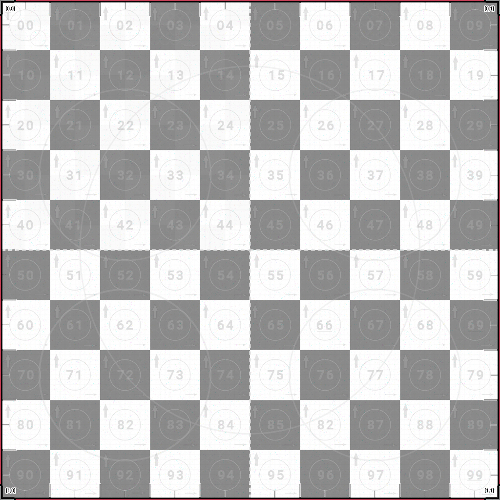

Friday, ‎August ‎2, ‎2013 | Alan Mattanó | Soaring Stars lab | Buenos Aires Argentina.

# 🎯 UV-Checker-Grid 
# High-Precision Default UV Test Texture for 3D Workflows

🔥 A **UV grid checker texture** engineered for professional UV debugging, unwrapping, testing, and alignment across all 3D pipelines. This high-contrast, ultra-readable grid is ideal for determining the optimal resolution for your 3D model and for identifying distortion, flipped UV islands, scaling issues, and seam errors.

🧠 Commonly referred to as:
**UVGrid**, **UVCheckerMap**, **UVTestGrid**, **UVMapGuide**, **UVUnwrapGrid**, **UVCheckerTexture**, or **UVDebugMap** — this texture consolidates the strengths of all of them into one powerful, go-to default map.

🎮 Compatible with Rhino, Blender, Unreal Engine, Unity, Substance 3D, RizomUV, and any tool supporting custom UV test textures.

> “A beautiful texture isn't just about surface — it's how it maps the soul of geometry.”  
> — *Inspired by the spirit of working with Pininfarina and German Frers*

## 📦 Download Resolutions

Click to download the UV texture map in your preferred resolution up to 4K:

- 🔹 [Download 1K](https://raw.githubusercontent.com/ALanMAttano/UV-Checker-Grid/main/textures/PrecisionUVmapTexture-AlanMatt-Vr4-02-1K.png)
- 🔹 [Download 2K](https://raw.githubusercontent.com/ALanMAttano/UV-Checker-Grid/main/textures/PrecisionUVmapTexture-AlanMatt-Vr4-06-2K.png)
- 🔹 [Download 4K](https://raw.githubusercontent.com/ALanMAttano/UV-Checker-Grid/main/textures/PrecisionUVmapTexture-AlanMatt-Vr4-01-4K.png)
- 🔹 [Download 8K (paid version)](https://textures.mattano.com)

---

## 🚀 Features: Technical Highlights

- 💎 **Optimized for unwrapping Mesh, NURBS, and SubD workflows**
- 🏁 **High-resolution Texture Checker Grid:** Built for maximum contrast and visibility in UV layout workflows.
- 💯 **Multiple Resolutions:** Available in 8K, 4K, 2K, and 1K — ensuring sharp results across performance needs.
- 🧱 **High-Density Grid + Pixel Noise:** Ideal for testing filtering, mip-mapping, and identifying blur artifacts.
- 🎯 **Numbered Coordinates:** marked from [0,0] to [1,1] for orientation and reference.
- ✅ **PBR-Friendly Grayscale:** Clean and neutral, optimized for the base color channel.
- 🔺 **Red Corner Indicators:** Aid in quick identification of UV rotation and alignment.
- 🧠 **Visual Debugging:** Instantly detects flipped, stretched, or overlapping UVs.
- 🧵 **Seamless for Tiled Layouts:** Supports UVEditor workflows with multi-tile UV meshes (UDIM).
- 🔢 **Rhino-Compatible Numbers:** Uses Rhino's default coordinate style for familiarity.
- 📐 **Coordinate Guidance:** Quadrant logic and axis cues for fast alignment.
- 🅰️ **Roboto Font:** Clean, legible type ensures clarity at any scale.
- 🔲 **Optimized Edge Outlines:** Enhance boundary visibility on dense meshes and around seams.
- ⚪ **Micro Scale Circles:** Small control circles for verifying uniform scale and squareness.
- ⚖️ **Proportional Circles:** Combine small and large visual anchors for detecting scale distortion across object sizes.
- ↕️↔️ **Directional Arrows:**  
    - **Thick upward arrows** = vertical orientation  
    - **Thin rightward arrows** = horizontal direction  
- 🗂️ **Region Indicators:** Bold center lines help identify large-scale segmentation and region centering.
- 🖼️ **8K Resolution Optimized:** Every detail maintains sharpness and readability, even at maximum resolution.

---

## 📸 Example: Rhino UVEditor Use

> This project was inspired by a pro tip shared on the Rhino forums:  
[🔗 McNeel Discourse: UV Mapping Tip](https://discourse.mcneel.com/t/uveditor-tip-uv-mapping-replace-your-uv-grid-texture)

> ! [Rhino UV Mapping Example](https://global.discourse-cdn.com/mcneel/uploads/default/original/3X/0/b/0b051d7bcc065e9414fc98e3123168969f20dcd0.mp4)

---

## 🛠️ How to Use

1. Import the texture into your preferred 3D application (e.g., RizomUV, Rhino, Blender, Substance).
2. Apply it to the object's base color or diffuse channel.
3. Open the UV Editor and begin your unwrapping process.
4. Adjust UVs for consistent scale, clean orientation, and alignment using numbers, arrows, and grid cues.

💡 **Pro Tip**: Use with reflective or displacement shaders to instantly reveal stretching or seams.

---

## 🧩 Compatibility

- [RizomUV](https://www.rizomuv.com/) — dedicated UV unwrapping software
- Rhinoceros 3D
- Blender — [UV Unwrapping Course](https://www.udemy.com/course/learn-uv-unwrapping-with-blender-for-unity-3d-game-design)
- Substance Painter / Substance Designer
- Unreal Engine (UE4 & UE5)
- Unity URP / HDRP
- Cinema4D, 3ds Max, Maya, Modo
- Any rendering engine or 3D modeling tool with UV support

---

## 📖 License

This project is licensed under the **[MIT License](https://github.com/ALanMAttano/UV-Checker-Grid/blob/main/LICENSE)** — free for commercial and non-commercial use.  
Attribution appreciated, but not required.

---

## 💬 Feedback & Community

Open an issue for bugs, ideas, or suggestions.  
Pull requests are welcome — let’s continue to improve UV workflows together.

---

## 🤝 Contribute

Do you have any ideas for new features? Need a 64 or 128-division version? Want to localize fonts or add colorblind-safe variants?  
Open an issue or submit a PR. UV-Checker-Grid is built by designers, for designers.

---

## 💬 Stay Inspired

> “Engineered with elegance.  
> Designed for those who demand **functionality with form**.”

---

### 🔗 Related Tools & Resources

- [Rhino UVEditor Documentation](https://www.rhino3d.com)
- [Blender UV Mapping Guide](https://docs.blender.org/manual/en/latest/modeling/meshes/uv/editing.html)
- [Substance Workflow Tips](https://substance3d.adobe.com)

---

