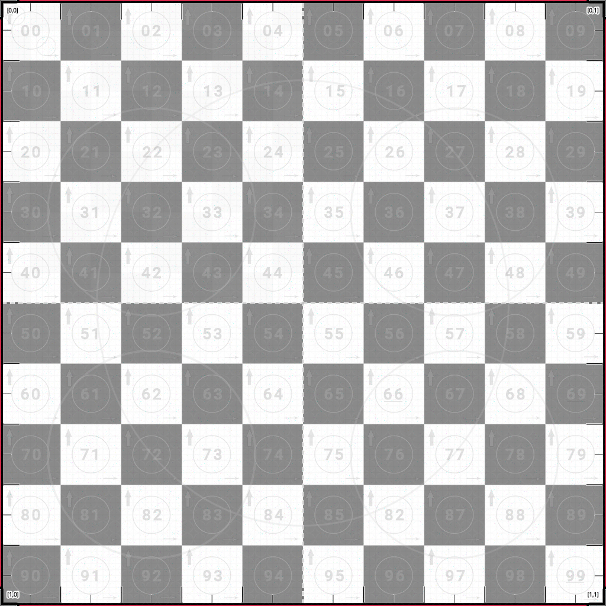
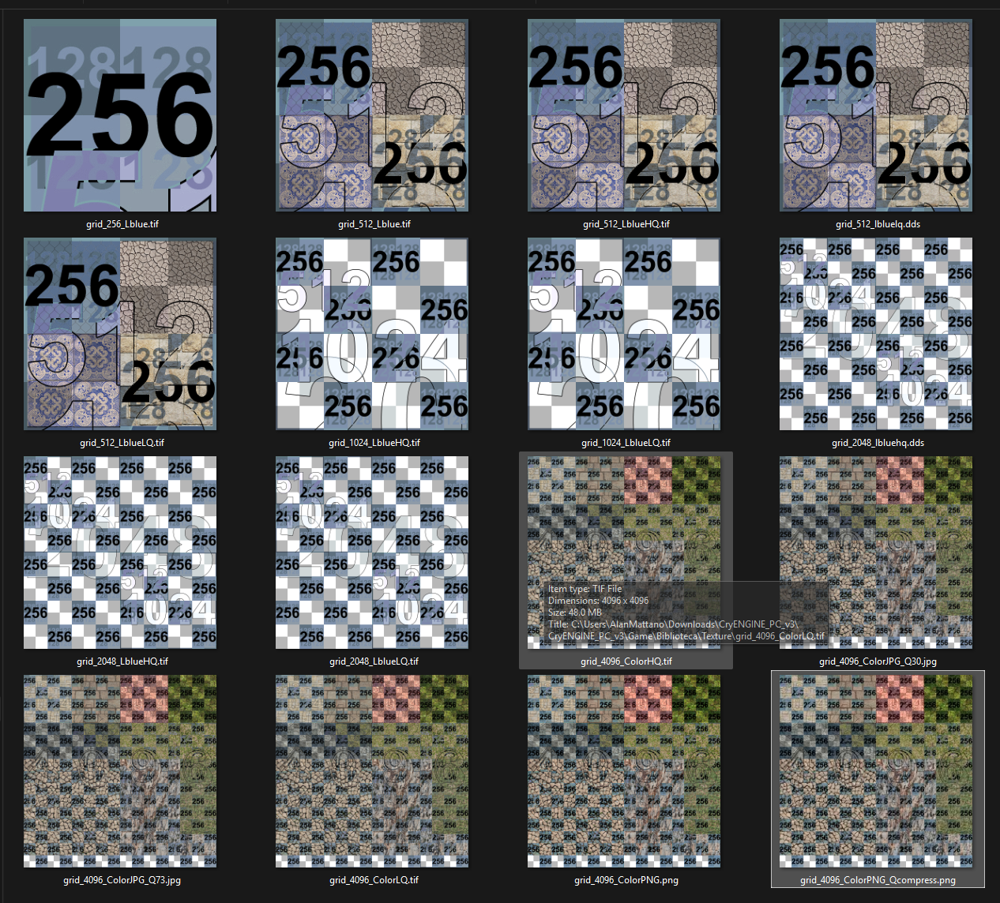
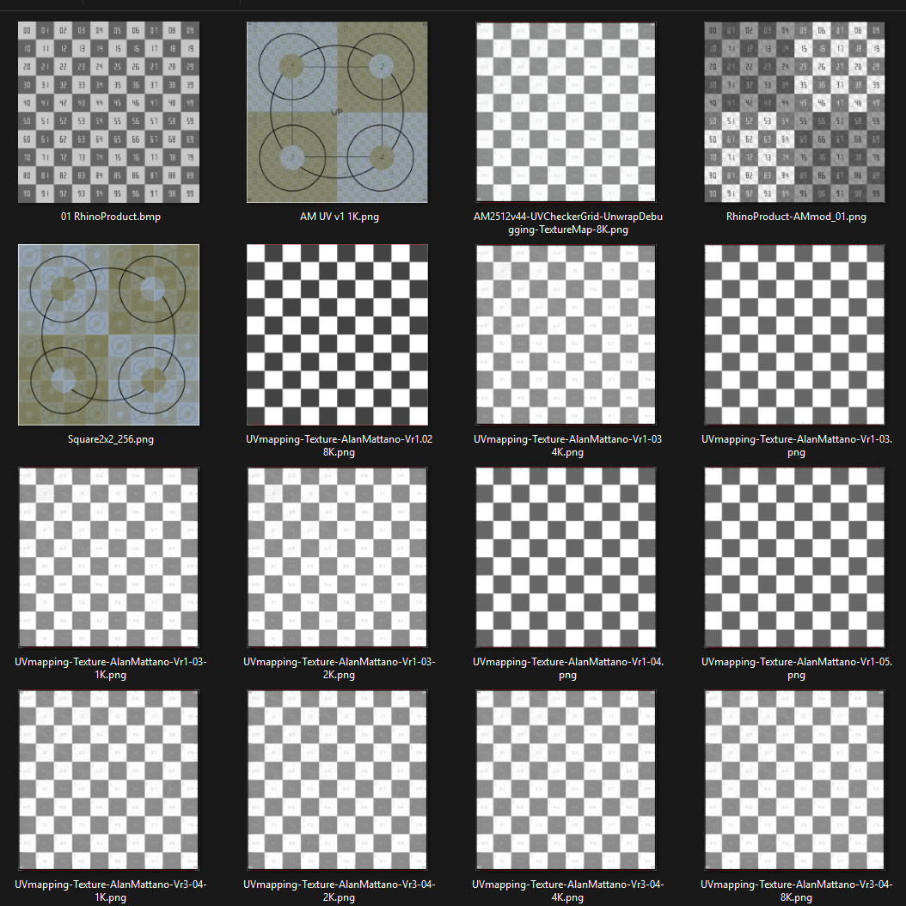

**AM2512: Friday, ‎August ‎2, ‎2013 | Alan Mattanó | Soaring Stars lab | Buenos Aires Argentina.**

# 🎯 UV-Checker-Grid 

# High-Precision Default UV Test Texture for 3D Workflows

---

## 📖 License

These PNG UV Checker Grid textures are licensed under the **[CC-BY 4.0](https://creativecommons.org/licenses/by/4.0/)** — you are free to share (ANY USE) even commercially. Attribution appreciated, but not required.

These UV Checker Grid script code .sbs (and .sbsar) files are licensed under the **[MIT License](https://github.com/ALanMAttano/UV-Checker-Grid/blob/main/LICENSE)** — free for commercial and non-commercial use. Attribution appreciated, but not required.

---

🏁 A **UV grid checker texture** engineered for professional UV debugging, unwrapping, testing, and alignment across all 3D pipelines. This high-contrast, ultra-readable grid is ideal for determining the optimal resolution for your 3D model and for identifying distortion, flipped UV islands, scaling issues, and seam errors.

🧠 Commonly referred to as:
**UVGrid**, **UVCheckerMap**, **UVTestGrid**, **UVMapGuide**, **UVUnwrapGrid**, **UVCheckerTexture**, or **UVDebugMap** — this texture consolidates the strengths of all of them into one powerful, go-to default map.

> “A beautiful texture isn't just about surface — it's how well it maps the soul of geometry.”  
> — *Inspired by the spirit of working with Pininfarina and German Frers*

## 📦 Download Formats

Get the UV-Checker-Grid in various formats optimized for different pipelines:

| Format | Description | File | Version |
|--------|-------------|------|---------|
| `.sbsar` | **Only 390Kb Substance Archive** — compiled, lightweight version for deployment at runtime use in game engines and 3D unwrapping pipelines. That can be deployed when installing the application. Under MIT License. | [UV-CheckerGrid Vr5.6 .sbsar](https://github.com/ALanMAttano/UV-Checker-Grid/raw/main/procedural/UV-CheckerGridVr56.sbsar) | 5.6 |
| `.sbs` | Editable **Substance Designer** source code file for developers who want to modify or build their own variant. Under MIT License. | [UV-CheckerGrid Vr5.6 .sbs](https://raw.githubusercontent.com/ALanMAttano/UV-Checker-Grid/main/procedural/UV-CheckerGridVr56.sbs) | 5.6 |
| 🖼️ PNG | 1K–8K UV grid image for direct use in materials or testing. Under CC-BY 4.0 License.  | [Go To Download PNG](##download-png)  | 4.4 |

> 🎮 Compatible with: Rhinoceros 3D, RizomUV, Blender, Unreal Engine, Unity, Substance Player, Marmoset, and any 3D tool supporting custom UV map textures

## Download PNG
⚙️ Click to download the preferred UV texture resolution up to 4K:

- 🔹 [Download 512](https://raw.githubusercontent.com/ALanMAttano/UV-Checker-Grid/main/textures/AM2512v44-UVCheckerGrid-UnwrapDebugging-TextureMap-512.png)
- 🔹 [Download 1K](https://raw.githubusercontent.com/ALanMAttano/UV-Checker-Grid/main/textures/AM2512v44-UVCheckerGrid-UnwrapDebugging-TextureMap-1K.png)
- 🔹 [Download 2K](https://raw.githubusercontent.com/ALanMAttano/UV-Checker-Grid/main/textures/AM2512v44-UVCheckerGrid-UnwrapDebugging-TextureMap-2K.png)
- 🔹 [Download 4K](https://raw.githubusercontent.com/ALanMAttano/UV-Checker-Grid/main/textures/AM2512v44-UVCheckerGrid-UnwrapDebugging-TextureMap-4K.png)
- 🔹 [Download 8K (paid version)](https://textures.mattano.com)

---

## 💖 Sponsor This Project

If the "UV Checker Grid" high-precision UV test texture has improved your unwrapping workflow, please consider supporting its development. Your contribution helps maintain, update, and expand free tools designed to save you time and effort in your 3D work.

---

## 🚀 Features: Technical Highlights

- 💎 **Optimized for unwrapping Mesh, NURBS, and SubD**
- 🏁 **High-resolution Texture Checker Grid:** Built for good contrast and visibility in UV layout workflows.
- 💯 **Multiple Resolutions:** Available in 8K, 4K, 2K, 1K, and lower — ensuring sharp results across performance needs.
- 🖼️ **8K Resolution Optimized:** Every detail maintains sharpness and readability, even at maximum resolution.
- 🧱 **High-Density Grid + Pixel Noise:** Ideal for testing filtering, mip-mapping, and identifying blur artifacts.
- ✅ **PBR-Friendly Grayscale:** Clean and neutral, optimized for the base color channel.
- 🧠 **Visual Debugging:** Instantly detects flipped, stretched, or overlapping UVs.
- 🧵 **Seamless for Tiled Layouts:** Supports UVEditor workflows with multi-tile UV meshes (UDIM).
- 🎯 **Numbered Coordinates:** marked from [0,0] to [1,1] for orientation and reference.
- 🔢 **Rhino-Compatible Numbers:** Uses Rhino's default coordinate style for familiarity (from 00 to 99).
- 🅰️ **Roboto Font:** Clean, legible type ensures clarity at any scale.
- 📐 **Coordinate Guidance:** Quadrant logic and axis cues for fast alignment.
- 🔲 **Optimized Edge Outlines:** Enhance boundary visibility on dense meshes and around seams.
- 🔺 **Red Corner Indicators:** Aid in quick identification of UV rotation, edge and alignment.
- ⚪ **Micro Scale Circles:** Small control circles for verifying uniform scale and squareness.
- ⚖️ **Proportional Circles:** Combine small and large visual anchors for detecting scale distortion across object sizes.
- ↕️↔️ **Directional Arrows:**  
    - **Thick upward arrows** = vertical orientation  (pine tree feeling)
    - **Thin rightward arrows** = horizontal direction  (wind feeling)
- 🗂️ **Region Indicators:** Bold center lines help identify large-scale segmentation and region centering.

---

## 📸 Example: Rhino UVEditor Use

> This project was inspired by a pro tip shared on the Rhino forums:  
[🔗 McNeel Discourse: UV Mapping Tip](https://discourse.mcneel.com/t/uveditor-tip-uv-mapping-replace-your-uv-grid-texture)

> ! [Rhino UV Mapping Example](https://global.discourse-cdn.com/mcneel/uploads/default/original/3X/0/b/0b051d7bcc065e9414fc98e3123168969f20dcd0.mp4)

---

## 🛠️ How to Use

1. Import the texture into your preferred 3D application (e.g., RizomUV, Rhino, Blender, Substance).
2. Apply it to the object's base color or diffuse channel.
3. Open the UV Editor and begin your unwrapping process.
4. Adjust UVs for consistent scale, clean orientation, and alignment using numbers, arrows, and grid cues.

💡 **Pro Tip**: Use with reflective or displacement shaders to instantly reveal stretching or seams.

---

## 🧩 Compatibility

- [RizomUV](https://www.rizomuv.com/) — best UV mesh unwrapping software
- [Rhinoceros 3D](https://www.rhino3d.com/) — dedicated 3D modeling software specific for designers (like Alias)
- Blender — [UV Unwrapping Course](https://www.udemy.com/course/learn-uv-unwrapping-with-blender-for-unity-3d-game-design)
- Substance Painter / Substance Designer
- Unreal Engine (UE4 & UE5)
- Unity URP / HDRP
- Cinema4D, 3ds Max, Maya, Modo
- Any rendering engine or 3D modeling tool with UV support

---

## 💬 Feedback & Community

Open an issue for bugs, ideas, or suggestions.  
Pull requests are welcome — let’s continue to improve UV workflows together.

---

## 🤝 Contribute

Do you have any ideas for new features? Need a 64 or 128-division version? Want to localize fonts or add colorblind-safe variants?  
Open an issue or submit a PR. UV-Checker-Grid is built by designers, for designers.

---

## 💬 Stay Inspired

> “Engineered with elegance.  
> Designed for those who demand **functionality with form**.”

---

### 🔗 Related Tools & Resources

- [RizomUV](https://www.youtube.com/@RizomUV) — official unwrapping tutorials
- [Rhino UVEditor Documentation](https://www.rhino3d.com/features/rendering/uv-mapping/)
- [Blender UV Mapping Guide](https://docs.blender.org/manual/en/latest/modeling/meshes/uv/editing.html)
- Blender — [UV Unwrapping Course](https://www.udemy.com/course/learn-uv-unwrapping-with-blender-for-unity-3d-game-design)
- [Substance Workflow Tips](https://www.youtube.com/@Substance3D)

---

### 🔥 Evolution Resume

I began creating and selling textures in 2007, and by 2011, This texture map is designed for unwrapping various types of 3D models. I was developing blue grid textures specifically for video games. One of the key purposes of these textures is to help determine the optimal texture size, keeping it as small as possible while preserving material detail.

That’s why I initially used those huge, ugly numbers. Things got even messier when I started adding different materials. lol Draft but ready early attempts!

Each year, I refine the texture, making it cleaner and more efficient. I began by identifying the features I was using intuitively. Then, by extracting and isolating those elements, I created specific patterns, icons or symbol-shaped objects to handle each individual task (Features: Technical Highlights list).

I didn’t create the Rhino one, but I use it as inspiration, trying to follow its spirit as closely as possible. The original blue color scheme and font were part of my style, but they ultimately proved too specific and distracting. The same goes for the Rhino font.

I moved toward a more neutral gray and switched to Roboto, a widely used and familiar font, so that it wouldn’t visually interfere or draw unnecessary attention. I try to remove myself from the design as much as possible and keep pushing by avoiding getting in my own way.

Happy unwrapping, 
Alan

---

